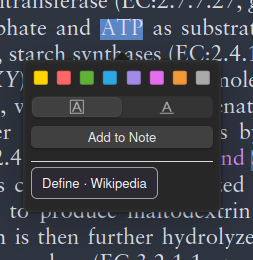

# Science Lens

Look up unfamiliar terms on Wikipedia while reading a PDF in Zotero. Select a word or short phrase, click **Define · Wikipedia**, and read a concise definition in a panel inside the reader.

**[Download Science Lens 0.1.1 (.xpi)](https://github.com/AriyanBe/Science-Lense/releases/download/v0.1.1/science-lens-0.1.1.xpi)** · [All releases](https://github.com/AriyanBe/Science-Lense/releases) · [Report an issue](https://github.com/AriyanBe/Science-Lense/issues)

## Example



In this example, **ATP** is selected in a scientific paper. Science Lens adds the **Define · Wikipedia** button beneath Zotero's existing annotation controls. Click it to request a definition. The screenshot shows the selection menu, before the definition panel opens; the highlighting and **Add to Note** controls belong to Zotero.

## Features

- Definitions from **English Wikipedia**, with an article title, short summary, and description when available.
- A thumbnail when the article supplies a supported Wikimedia image, plus links to the full article and image credits.
- **Other matches** to choose a more relevant article; **Choose meaning** for disambiguation results.
- Search suggestions when an exact article is unavailable, and a retry option for failed requests.
- A reader panel that follows system colors, supports **Escape** to close, and restores the previous keyboard focus.
- No API key, separate account, subscription, or build tools needed to install the release.

## Requirements and compatibility

| Requirement | Details |
| --- | --- |
| Application | Zotero desktop **10.0.x**; the manifest allows 10.0 through 10.0.* |
| Document | A PDF opened in Zotero's built-in reader with selectable text |
| Network | Internet access to English Wikipedia and Wikimedia for lookups and images |
| Verified installation | Zotero **10.0.2 on Linux 64-bit**; see [validation details](VALIDATION.md) |

Windows and macOS have not been independently tested. Zotero versions outside 10.0.x are not supported by this release's manifest. The recorded automated installation check covers plugin installation, startup, and disabling; it does not establish complete visual workflow coverage on every platform.

## Download and install

1. Download **[science-lens-0.1.1.xpi](https://github.com/AriyanBe/Science-Lense/releases/download/v0.1.1/science-lens-0.1.1.xpi)**. You can also find it under **Assets** on the [release page](https://github.com/AriyanBe/Science-Lense/releases/latest).
2. Open Zotero desktop and choose **Tools → Plugins**.
3. Drag the downloaded `.xpi` file onto the Plugins window and complete Zotero's installation prompt.
4. If Zotero requests a restart, restart it. Open a PDF and select a short term to find **Define · Wikipedia**.

These steps follow [Zotero's official plugin installation instructions](https://www.zotero.org/support/plugins). Install the `.xpi` file directly; do not extract it. GitHub's **Source code (zip)** and **Code → Download ZIP** downloads contain the project source, not the ready-to-install plugin.

### Updates and removal

Updates are **manual** in version 0.1.1. Download a newer `.xpi` from this repository's Releases page when available and install it through Zotero's Plugins window.

The manifest currently uses `https://science-lens.invalid/updates.json`, a reserved placeholder rather than an operating update service. Zotero's update checks may fail for this plugin. The repository's `updates.json` contains no update entries; automatic updates are not configured.

To disable or remove Science Lens, open **Tools → Plugins**, locate **Science Lens — Wikipedia definitions**, and use Zotero's plugin controls.

## How to use it

1. Open a PDF inside Zotero.
2. Select a word or short phrase, such as **ATP**, **starch synthase**, or a species name.
3. Click **Define · Wikipedia** in the selection popup.
4. Read the summary in the Science Lens panel. Use **Read full article ↗** to open the source article in your browser.
5. If the first result is not the intended meaning, click **Other matches** and choose an article. Disambiguation pages offer **Choose meaning** instead.
6. Click **Close** or press **Escape** to return to reading.

Selections must contain no more than **160 characters and 16 space-separated words** after normalization. Empty or longer selections do not get a lookup button. Lookup starts when you click the button, not simply when you select text.

The “Possible scientific name” label is a text-pattern heuristic. It does not validate taxonomy or identify a species. Definitions are Wikipedia summaries, not generated answers or an analysis of the surrounding paper. Check the linked article and its references when accuracy matters.

## Privacy and data handling

- Clicking the lookup button sends the selected term to Wikipedia over HTTPS. Search and article-choice actions can send that term or the chosen article title as additional requests.
- The plugin does not upload the PDF, surrounding paragraphs, notes, or your Zotero library. As with other network requests, the destination receives ordinary connection information such as your IP address.
- Article thumbnails load from supported Wikimedia image hosts. External links open through Zotero in your browser.
- Summaries are cached in memory for up to **one hour**, with at most **100 entries**. The cache is cleared when the plugin shuts down; it is not written to a lookup-history file.
- The plugin code contains no analytics or telemetry service. Remote summaries are rendered as text rather than injected HTML.

## Troubleshooting

| Problem | What to check |
| --- | --- |
| Zotero rejects the download | Confirm that you downloaded the `.xpi` release asset, not a source ZIP, and are running Zotero 10.0.x. Older 0.1.0 packages had an installation metadata problem fixed in 0.1.1. |
| No **Define · Wikipedia** button | Confirm that the plugin is enabled, the PDF is open in Zotero's reader, and the selected text is within the length limits. An image-only scan needs selectable text before this feature can work. |
| Wikipedia could not be reached | Check your connection and access to Wikipedia, then click **Retry**. Requests have a 12-second timeout; **Search Wikipedia** also provides a browser link. |
| Wrong definition or ambiguous acronym | Use **Other matches** or **Choose meaning**, or select a more specific phrase. The plugin does not infer meaning from the surrounding document. |
| No matching articles | Try a shorter term, an alternate spelling, or the English name. This release queries English Wikipedia only. |
| No thumbnail | Some articles have no suitable image. Failed image loads are hidden while the text remains available. |
| Automatic update check fails | Version 0.1.1 has no hosted update service. Install new releases manually. |

If a problem persists, [open an issue](https://github.com/AriyanBe/Science-Lense/issues) with your Zotero version, operating system, plugin version, steps to reproduce, and any error message. Include a short example term and a screenshot when useful, avoiding private document content.

## Build from source

The plugin uses plain JavaScript and a Python standard-library packaging script. There are no npm or pip dependencies to install. The existing CI uses **Node.js 22** and **Python 3.12**.

```sh
git clone https://github.com/AriyanBe/Science-Lense.git
cd Science-Lense
python3 build.py
```

The output is `dist/science-lens-0.1.1.xpi` for the current manifest version. Install that file using the instructions above. On systems where Python is invoked as `python` or `py`, substitute that command for `python3`.

The builder validates Zotero metadata, places plugin files at the archive root, checks ZIP integrity, and fixes archive timestamps and file permissions for reproducible output. Generated files in `dist/` are ignored by Git and distributed as release assets.

### Run the checks

```sh
node --check src/bootstrap.js
node --check src/core.js
node tests/core.test.cjs
python3 -m unittest discover -s tests -p 'test_*.py'
python3 build.py
```

GitHub Actions runs these checks on pushes and pull requests and uploads a `science-lens-plugin` build artifact. Public releases provide the convenient `.xpi` download for users.

### Project layout

```text
src/
  bootstrap.js       Zotero lifecycle, selection button, and definition panel
  core.js            Normalization, URL checks, Wikipedia adapter, and cache
  manifest.json      Plugin identity, version, and Zotero compatibility
tests/               JavaScript core and Python packaging tests
docs/images/         README example screenshot
build.py             Reproducible XPI builder and validator
updates.json         Empty update manifest; automatic updates are unconfigured
VALIDATION.md        Recorded installation results and testing limitations
validation/          Machine-readable installation results
.github/workflows/   Test and build workflow
```

## Contributing

Bug reports, documentation improvements, and pull requests are welcome. Describe the problem and expected behavior, keep changes focused, and run the checks above before submitting code changes. For reader UI changes, also verify the behavior in Zotero and report the version and platform used. Compatibility changes should include real installation evidence rather than only widening the manifest's version range.

## License and attribution

Science Lens source code is available under the [MIT License](LICENSE).

Wikipedia summaries are credited in the panel to Wikipedia contributors with a **CC BY-SA 4.0** link. Images may have their own licenses; follow **Image & credits** to inspect the relevant source and attribution. The code license does not replace the licenses of Wikipedia text, images, or material visible in the example screenshot.
